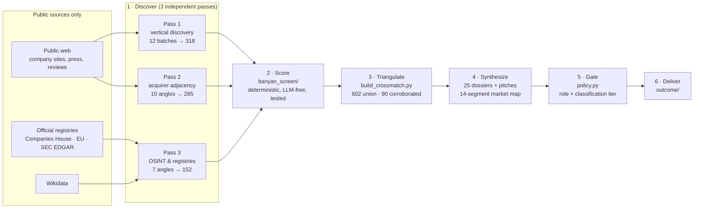

<div align="center">

# Market Research Intelligence

**An agentic M&A screening pipeline for Banyan Software — built from the public web only.**

[](https://github.com/iam-pattan/Market-Research-Intelligence/actions/workflows/ci.yml)


Discover vertical B2B software companies → score them against Banyan's buy‑and‑hold‑forever thesis → triangulate across three independent discovery passes → produce analyst‑ready dossiers and outreach pitches → gate every output by who is allowed to see it.

**[Deliverables](#-deliverables) · [Quick start](#-quick-start) · [How it works](#-how-it-works) · [Repository layout](#-repository-layout) · [Access control](#-access-control) · [Validation](#-validation) · [Docs](#-documentation)**

</div>

---

## 📦 Deliverables

Everything the team consumes lives in **[`outcome/`](outcome/)**. The HTML files are fully self‑contained — download and open in any browser.

| Deliverable | For | What's inside |
|---|---|---|
| [**Banyan Target Intelligence**](outcome/intelligence_hub.html) `intelligence_hub.html` | Leadership · Tech leads · Sales | One‑stop hub: **top‑250** screened companies (sortable, filterable, per‑criterion rationale, revenue estimate + confidence, profitability signal, ownership), **25 deep dossiers with outreach pitches** (18 SEND), **14‑segment market map**, the outreach playbook, method & QC |
| [**Layered Data Access Architecture**](outcome/access_architecture.html) `access_architecture.html` | Tech leads · Security · Platform | Six‑layer IAM design, classification tiers, role × tier matrix, a **live role lens driven by the real `policy.py`**, and a direct answer to *"what do Claude users need?"* |
| [**How the Banyan Screen Was Built**](outcome/project_walkthrough.html) `project_walkthrough.html` · [`.docx`](outcome/How_the_Banyan_Screen_Was_Built.docx) | Everyone | Nine‑stage walkthrough of the thinking: sources, the codex/Workflow research mechanism, scoring, triangulation, gating, validation, and every skill / agent / hook used |

<details>
<summary><b>Earlier dashboards</b> (in <code>reports/</code>)</summary>

| File | What |
|---|---|
| `dashboard.html` | Top‑250 dual‑rubric screen |
| `market_synthesis.html` | 14‑segment market map, shortlist, whitespace, competing consolidators |
| `banyan_dossiers_pitches.html` | Banyan‑rubric top‑25 dossiers + pitches (**18 SEND**) |
| `dossiers_pitches.html` | Best‑of‑both top‑25 (contrast: 2 SEND) |
| `crossmatch.html` | 3‑way discovery triangulation (602 union · 90 corroborated · 176 strong net‑new) |
| `iam_hierarchy.html` | Conceptual IAM model (RBAC + ABAC + data classification) |

</details>

---

## 🚀 Quick start

```bash
pip install -r requirements.txt

# 1. Run the test suite (scoring core, IAM policy, page builders)
python -m pytest -q

# 2. Score the record set under both rubrics, curate to top 250
python -m banyan_screen.run data/records/*.json --top=250 --out=reports

# 3. Rebuild the outcome deliverables from data/
python analysis/build_intelligence_hub.py         # outcome/intelligence_hub.html
python analysis/build_access_architecture.py      # outcome/access_architecture.html
python analysis/build_walkthrough_docx.py         # outcome/How_the_Banyan_Screen_Was_Built.docx

# 4. Re-derive every figure on the pages from source data (non-zero exit on mismatch)
python analysis/qc_consolidated_pages.py
```

<details>
<summary><b>Regenerate the earlier analysis reports</b></summary>

```bash
python analysis/segment.py                 # 226 micro-verticals → 14 macro-segments
python analysis/build_market_report.py
python analysis/build_crossmatch.py
python analysis/build_dossiers.py          # best-of-both dossiers (IAM-gated, fails closed on role)
python analysis/build_dossiers.py data/research/raw_dossiers_banyan.json \
       data/research/top25_banyan.json reports/banyan_dossiers_pitches.html
python analysis/validate_grounding.py      # dossier facts vs raw research text
```

Scripts anchor on `ROOT = Path(__file__).parent.parent`, so they stay one level below the repo root. The rubrics in `config/` are loaded by relative path from the repo root (`run.py` and the tests), so run commands from the root.

</details>

---

## 🧭 How it works



**The one design rule:** the LLM proposes signals *with confidence*; deterministic code computes the tier. `rubric_engine.py` alone runs `composite → confidence‑discount → gates → tier`, so every score is reproducible and every result carries an audit `rationale`.

<details>
<summary><b>Why most genuine targets land at tier C</b></summary>

`adjusted = composite × (0.5 + 0.5 × confidence)`

Private‑company financials are mostly unverifiable from the public web, so confidence is low and the score is discounted. Tier C means *"verify in diligence"*, not *"bad fit"*. A high growth score paired with a mediocre Banyan score is the VC tell — a non‑target.

| Banyan tier (of 250) | Count |
|---|---|
| B — confirmed Banyan‑fit | 23 |
| C — verify | 202 |
| Rejected (loss evidence) | 24 |
| Insufficient data | 1 |

</details>

<details>
<summary><b>How the research was actually pulled</b></summary>

Every research stage is a Claude Code **Workflow** (`analysis/workflows/*.js`) that fans out N subagents; each agent calls the **OpenAI Codex CLI with web search** (ChatGPT‑authenticated, no API key) and returns cited findings; a synthesis agent turns those into JSON under a schema. The raw research text is kept in `data/research/codex_research/` as an audit trail — which is what later let a script prove **98.6 % (409/415)** of dossier facts were grounded.

| Workflow | Fan‑out | Output |
|---|---|---|
| vertical discovery | 12 batches | `data/records/*.json` (333) |
| `independent_discovery_wf.js` | 10 angles | `independent_results.json` (285) |
| `osint_discovery_wf.js` | 7 angles + 34 verifications | `osint_results.json` (152) |
| `market_synthesis_wf.js` | 29 agents | `market_synthesis.json` |
| `banyan25_dossiers_wf.js` | 50 agents | `raw_dossiers_banyan.json` |

No paid data providers (PitchBook, Crunchbase, Grata). Two tools that failed on authentication (Perplexity, Firecrawl) are recorded in [`docs/TOOLING_LOG.md`](docs/TOOLING_LOG.md), not hidden.

</details>

---

## 🗂 Repository layout

```
Market-Research-Intelligence/
├── outcome/                  ★ Consolidated deliverables (3 HTML pages + Word walkthrough)
├── banyan_screen/            Core scoring package — deterministic, LLM-free
│   ├── rubric_engine.py        composite → confidence-discount → gates → tier
│   ├── ingest.py               record → per-criterion CriterionScores (both rubrics)
│   ├── run.py                  CLI: dedup → score → rank → curate
│   └── policy.py               IAM enforcement: classify → enforce/guard → pitch_visible
├── config/
│   ├── banyan.yaml             Buy-and-hold rubric (weights, gates, thresholds)
│   └── growth.yaml             Contrast rubric for VC/scaling companies
├── data/
│   ├── records/                333 discovered company records (12 vertical batches)
│   ├── screen/                 Scored, curated top-250 (results.json, ranked.csv)
│   └── research/               Passes 2–3, cross-match, dossiers, synthesis, grounding, raw codex research
├── analysis/
│   ├── build_intelligence_hub.py        → outcome/intelligence_hub.html
│   ├── build_access_architecture.py     → outcome/access_architecture.html
│   ├── build_walkthrough_docx.py        → outcome/How_the_Banyan_Screen_Was_Built.docx
│   ├── qc_consolidated_pages.py         Re-derives every figure on the pages from data/
│   ├── segment.py · build_market_report.py · build_dossiers.py · build_crossmatch.py · validate_grounding.py
│   ├── templates/              HTML templates the builders inject data into
│   └── workflows/              Multi-agent orchestration scripts (Claude Code Workflow tool)
├── reports/                  Earlier self-contained HTML dashboards
├── skills/banyan-sales-pitch/  Reusable outreach skill (rules, templates, playbook) — Sales/BD-gated
├── tests/                    53 tests: scoring core, IAM policy, page builders
├── docs/                     HLD · LLD · HANDOFF · TOOLING_LOG · design spec & plan
└── .github/workflows/ci.yml  pytest → rebuild outcome/ → QC script
```

---

## 🔐 Access control

Output is filtered by consumer role **in code**, not by convention. `banyan_screen/policy.py` classifies every field into one of five tiers and applies a per‑role policy — deny by default for unknown roles and unrecognised fields.

| Role | Receives | Never receives |
|---|---|---|
| **Data Science** | Aggregates only | Per‑record output (refused outright), contacts, financials, deal intent |
| **Finance** | Financials, identity, signals | Contacts, deal intent, outreach copy |
| **Sales / BD** | Identity, signals, contacts *(masked)*, the outreach pitch | Financials, deal intent |
| **Leadership** | Deal intent; contacts and financials *(masked)* | Outreach copy, raw financials |

```python
from banyan_screen.policy import guard
guard("finance_analyst", record)   # revenue kept, contacts dropped, pitch withheld
guard("ds_analyst", [record])      # {"error": "role is aggregate_only; per-record output denied"}
```

<details>
<summary><b>What a Claude user needs to sit behind this wall</b></summary>

Two things, both **outside** the model: an SSO identity whose role travels as a claim, and an enforcement point (an MCP server or API) that runs `guard(role, payload)` *before* data reaches Claude's context. No per‑role Claude instances, no "system prompt says don't reveal" — once a field is in context it has been disclosed. The full design, with a live per‑role lens, is in [`outcome/access_architecture.html`](outcome/access_architecture.html).

</details>

---

## ✅ Validation

| Check | Result |
|---|---|
| Unit tests (`tests/`) | **53 passing** — scoring core, IAM policy, page builders |
| Page re‑derivation (`analysis/qc_consolidated_pages.py`) | **0 mismatches** — every figure on the outcome pages recomputed from `data/` and `policy.py` |
| Grounding (`analysis/validate_grounding.py`) | **409 / 415** dossier facts (98.6 %) found in the raw research; the 6 unmatched were extractor false‑positives |
| Second‑model QC (`validation-loop`) | Two rounds on the original build (65.9 → 66.9, judges diverged); **PASS 85.1** on the consolidation |
| Triangulation | 602‑company union · 90 corroborated by ≥ 2 passes · **11 false "founder‑owned" caught** (e.g. Vagaro = PE, Agiloft = FTV) |

CI runs the tests, rebuilds `outcome/` from `data/`, and runs the QC script on every push.

---

## 📚 Documentation

| Doc | Read it for |
|---|---|
| [`docs/HLD.md`](docs/HLD.md) | System‑level architecture: the idea, subsystems, data flow, execution model |
| [`docs/LLD.md`](docs/LLD.md) | Module‑level design: algorithms, schemas, class/sequence diagrams |
| [`docs/HANDOFF.md`](docs/HANDOFF.md) | Session narrative, decisions, validation results, next steps |
| [`docs/TOOLING_LOG.md`](docs/TOOLING_LOG.md) | Exactly which skills, MCP servers, plugins and hooks were used — and which failed |
| [`skills/banyan-sales-pitch/`](skills/banyan-sales-pitch/) | The outreach skill: rules, templates, thesis/voice/compliance playbook |

<details>
<summary><b>Caveats to carry</b></summary>

- Revenue figures are web‑research estimates (~0.25–0.55 confidence) — directional, never underwrite from them.
- Margin / profit are **not available as numbers** for private companies; the screen carries a profitability *signal* (score + confidence + loss‑evidence flag). Real PBT exists only where accounts are filed (UK / EU registry names).
- Ownership calls are time‑sensitive — confirm cap tables before outreach.
- Banyan's "120+ acquired / 0 sold" is self‑reported positioning, not audited.

</details>

---

<div align="center">
<sub>Built with Claude Code · public web + official registries only · MIT License</sub>
</div>
