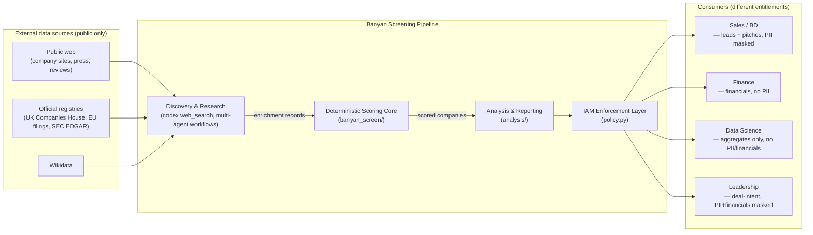
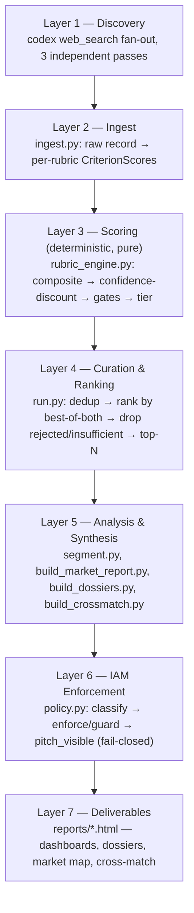
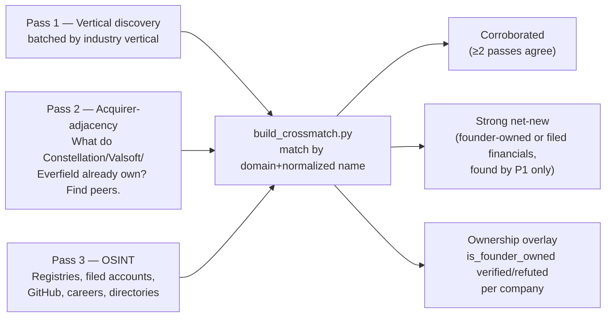

# High-Level Design (HLD) — Banyan M&A Screening

**Companion doc:** `LLD.md` (module-level detail) · `HANDOFF.md` (session narrative, results, decisions) · `README.md` (layout, quickstart)

---

## 1. The idea

**Banyan Software** acquires vertical B2B software companies and holds them **forever** — no PE-style flip, no resale clock. Its buy criteria are narrow and specific: profitable, high-recurring-revenue, founder/family-owned niche leaders roughly **$2M–$100M** in revenue. Sourcing that universe manually — across hundreds of fragmented micro-verticals, with no paid data access — is a market-research problem, not a data-entry problem.

This project is an **agentic pipeline** that does that sourcing end-to-end:

```
discover candidates  →  score them against Banyan's thesis  →  triangulate across
independent sources  →  produce dossiers + outreach pitches  →  gate every output
by who's allowed to see what
```

It is built as **public-web-only, discovery-first**: no PitchBook/Crunchbase/Grata. Every claim about a private company traces to a citable public source (a company's own site, a filed government registry, a search result) or is explicitly marked unverified.

## 2. Problem framing & constraints

| Constraint | Why it shapes the design |
|---|---|
| No paid data providers | Private-company financials are largely *unknowable* from the public web → the design must **quantify and propagate uncertainty**, not paper over it. |
| Discovery-first (no seed list, though one can be supplied) | Needs a **web-scale search capability**, not a database query — solved with LLM-driven `web_search` fan-out, not a fixed API integration. |
| Output consumed by multiple orgs (Sales, Finance, Data Science, Leadership) with different entitlements | Needs an **access-control layer on the output itself**, independent of how the data was produced. |
| A wrong "founder-owned" read is a real business risk (approaching a PE-controlled company as if it were an independent target) | Needs **explicit verification**, not just discovery — ownership claims must be checked against a second, independent source before being trusted. |
| One-off research exercise, not a live service | No database, no API server, no scheduler. The system is a **batch pipeline of scripts and orchestrated agent runs** that produce versioned file artifacts. |

## 3. System context



## 4. Major subsystems

**① Discovery & Research** — LLM-driven web discovery (codex `web_search`), run as multi-agent **Workflows**: fan out across verticals / acquirer-adjacency / OSINT registries, each agent returns structured, cited findings. Three independent passes exist specifically so their outputs can be **cross-validated** against each other (§6).

**② Deterministic Scoring Core** (`banyan_screen/`) — a pure, LLM-free Python package. Given a company record with per-criterion signals *and confidence*, it computes a composite score, applies hard gates (loss evidence → reject; sub-floor revenue → cap), discounts the whole score by how confident the inputs were, and assigns a tier. Two independent rubrics run side by side: **Banyan-fit** (buy-and-hold) and **Growth** (scaling/VC-backed) — see LLD §3–4 for the exact algorithm.

**③ Analysis & Reporting** (`analysis/`) — a set of standalone scripts that consume the scoring core's output and the raw discovery data to produce: macro-segment market analysis, per-lead dossiers + outreach pitches, and the 3-way discovery cross-match. These are orchestration/reporting scripts, not part of the tested core.

**④ IAM Enforcement Layer** (`banyan_screen/policy.py`) — a real filter applied to *every* piece of output, independent of how it was produced. Two layers: field-level data classification (financial/PII/MNPI/internal) and coarse role-based gating of whole artifacts (e.g., outreach narrative is Sales/BD-only). See LLD §7.

**⑤ Validation** — two independent checks close the loop: a second-model QC review (`/validation-loop:validate`, GLM 5.2 + Kimi 2.7 as tie-breaker) scores code/claims quality, and a grounding check (`analysis/validate_grounding.py`) verifies that synthesized dossier claims actually trace back to the raw research text, not to synthesis-step invention.

## 5. High-level architecture (layered view)



Layers 2–4 are the **tested, deterministic core** (46 unit tests, no network/LLM calls). Layers 1 and 5 are where LLM judgment and web research happen. Layer 6 sits **between** synthesis and delivery for every artifact that leaves the system — nothing skips it.

## 6. Data flow — triangulated discovery

A single discovery pass can miss real candidates or over/under-trust a source. The design runs **three independently-sourced passes** and cross-matches them, rather than trusting one:



This is the mechanism that catches a company that merely *looks* founder-owned (e.g., "privately held" language on a website) but is actually PE-controlled — pass-3's OSINT verification is checked against, and can override, the softer signal from passes 1–2.

## 7. Execution model — how this is actually built and run

This is **not a deployed service**. There is no server, database, or scheduler. It runs as:

- **A local Python package** (`banyan_screen/`) invoked via CLI (`python -m banyan_screen.run …`) — deterministic, fast (sub-second for hundreds of companies), fully unit-tested.
- **Claude Code multi-agent Workflows** (`analysis/workflows/*.js`) for anything requiring live web research — each Workflow fans out N agents in parallel/pipeline stages, where each agent calls **codex `web_search`** (OpenAI Codex CLI, no API key, ChatGPT-authenticated) for grounded, cited findings, then a second-stage agent synthesizes structured output under a JSON Schema contract.
- **Standalone analysis scripts** (`analysis/*.py`) run on demand to regenerate reports from the current data — no persistent process; every run reads JSON in `data/` and writes HTML to `reports/`.
- **File artifacts as the interface.** Every stage's output is a plain JSON or HTML file under `data/` or `reports/` — the pipeline has no hidden state; anything can be re-derived by re-running the relevant script against the files that exist.

This matches the nature of the task: a bounded research exercise producing a fixed set of deliverables, not an ongoing production system (see HANDOFF.md §9 for the migration path if it were to become one).

## 8. Technology choices

| Concern | Choice | Why |
|---|---|---|
| Scoring core | Pure Python 3.11+, dataclasses/enums, no dependencies beyond `pyyaml` | Determinism and testability — the score a company gets must be reproducible and auditable, not an LLM judgment call. |
| Web discovery | Codex CLI `web_search` (not a paid search API) | Only working, unauthenticated web-discovery tool available in this environment (WebSearch/firecrawl/perplexity were all blocked or auth-walled). |
| Orchestration | Claude Code **Workflow** tool (`pipeline`/`parallel`/`agent` primitives) | Deterministic fan-out/fan-in control flow around non-deterministic LLM calls, with schema-forced structured output and cached resume. |
| Config | YAML, loaded by relative path, validated on load | Rubric weights/gates/thresholds are business logic, not code — must be editable and reviewable without touching Python. |
| Reports | Self-contained HTML (inline CSS/JS, no build step) | Zero-dependency deliverables — open in any browser, nothing to install or host. |
| IAM | Hand-rolled Python module, not an external policy engine | Scope is one project's output shape; a real deployment would map this onto BQ row-level security / cloud IAM / OPA-Cedar (see HANDOFF.md). |

## 9. Non-functional design principles

- **Confidence is a first-class value, not a side note.** Every signal, every criterion score, and every final company score carries a confidence figure; the final score is *discounted* by it (`adjusted = composite × (floor + (1−floor)×confidence)`), so a thinly-sourced "great fit" cannot outrank a well-verified "good fit." See LLD §4.
- **Fail-closed, everywhere.** An unrecognized data field defaults to the most restrictive classification tier, not the most permissive. An unrecognized consumer role gets nothing. A build for a role that isn't entitled to pitch content refuses to run rather than silently omitting the pitch.
- **Every number has a rationale.** `ScoredCompany.rationale` records exactly which weighted terms produced a score — no black-box output.
- **Independent verification over single-source trust.** Ownership and ranking claims are cross-checked across independently-sourced passes (§6) and against a second LLM judge (HANDOFF.md §6) before being reported as findings.

## 10. What this HLD deliberately does not cover

Detailed algorithms, exact function signatures, class diagrams, and the enrichment-record schema live in **`LLD.md`**. Session-specific results (which companies scored where, validation scores, the reorg) live in **`HANDOFF.md`** — this document describes the *system*, not one run of it.
