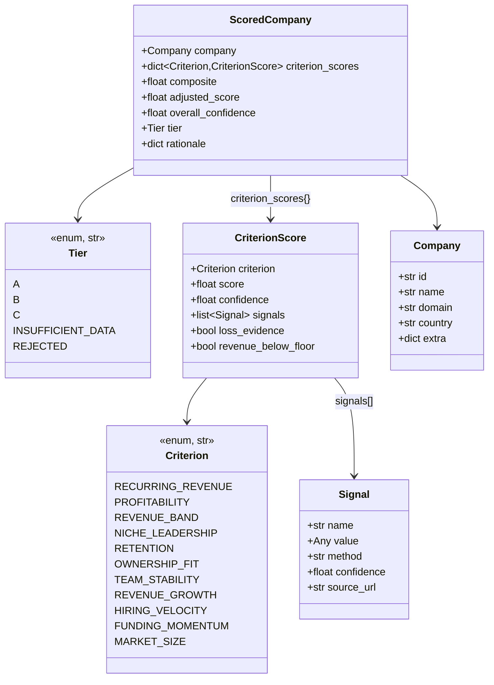
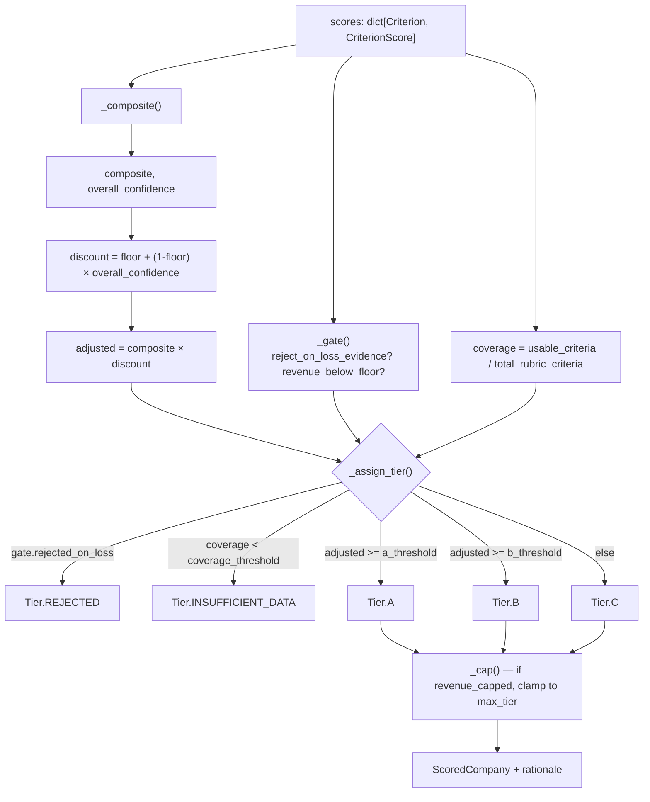
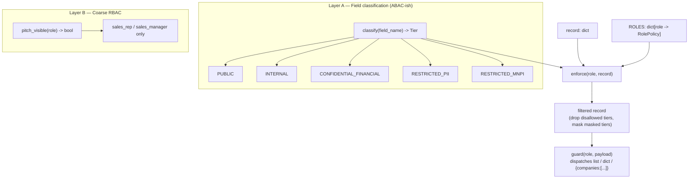
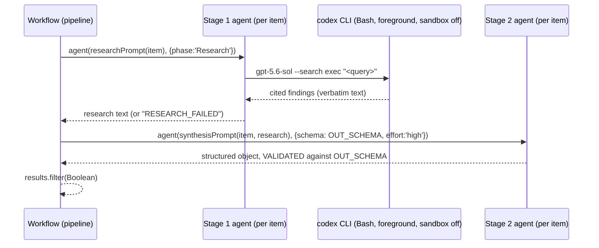

# Low-Level Design (LLD) — Banyan M&A Screening

**Companion doc:** `HLD.md` (system-level view) · `HANDOFF.md` (session results/decisions) · code is the final authority — this document is a map onto it, not a substitute for reading it.

---

## 1. Package/module map

```
banyan_screen/            deterministic core (pure Python, unit-tested, no network/LLM)
├── models.py               Criterion, Tier enums; Signal, CriterionScore, Company, ScoredCompany dataclasses
├── config.py               RubricConfig — loads/validates a rubric's weights, gates, thresholds from YAML
├── rubric_engine.py        score_company() — the ONLY place composite→discount→gate→tier logic lives
├── ingest.py                company_from_record(), banyan_scores(), growth_scores() — raw record → CriterionScores
├── input_loader.py         load_seed() — CSV/XLSX seed list → enrichment records
├── report.py                render_html(), write_outputs() — dashboard.html + ranked.csv + results.json
├── run.py                   CLI entrypoint: load → dedup → score → curate → write
└── policy.py                 IAM enforcement layer: classify(), enforce(), guard(), pitch_visible()

analysis/                 research-pipeline scripts (orchestration/reporting, not part of the tested core)
├── segment.py               macro-segment roll-up (226 micro-verticals → 14 segments)
├── build_market_report.py   renders reports/market_synthesis.html from segment + synthesis JSON
├── build_dossiers.py        renders lead-dossier + pitch decks, IAM-gated at build time
├── build_crossmatch.py      3-way discovery cross-match + ownership overlay
├── validate_grounding.py    checks dossier claims against raw codex research text
├── osint_wikidata.py        Wikidata firmographic enrichment (direct API, no LLM)
└── workflows/                multi-agent Workflow scripts (JS, run via the Workflow tool)
    ├── banyan25_dossiers_wf.js       (and its best-of-both sibling, same shape)
    ├── market_synthesis_wf.js
    ├── independent_discovery_wf.js
    └── osint_discovery_wf.js

skills/banyan-sales-pitch/  reusable Claude Code skill: pitch generation rules + templates
```

---

## 2. Data model



`Signal`/`CriterionScore` both validate their `score`/`confidence` fields to `[0.0, 1.0]` in `__post_init__` — an out-of-range value raises `ValueError` at construction, not silently clamps. **11 criteria total: 7 Banyan-fit + 4 growth-thesis**, sharing one enum so a criterion computed once (e.g. `RECURRING_REVENUE`, `NICHE_LEADERSHIP`, `RETENTION` appear in both rubrics) is reused, not recomputed.

## 3. Rubric configuration (`config.py` + `config/banyan.yaml`)

`RubricConfig` is loaded from YAML and **validated at load time** (`validate()`):
- `weights` must be a non-empty subset of `Criterion` and **sum to 1.0 ± 1e-3**.
- `a_threshold >= b_threshold`.
- Every threshold/floor value in `[0, 1]`.

YAML shape (from `config/banyan.yaml`, the Banyan rubric):
```yaml
weights:
  recurring_revenue: 0.25
  profitability: 0.20
  revenue_band: 0.10
  niche_leadership: 0.20
  retention: 0.10
  ownership_fit: 0.10
  team_stability: 0.05
gates:
  reject_on_loss_evidence: true
  revenue_floor_usd: 2000000
  revenue_below_floor_max_tier: C        # nullable — growth rubric sets this to null
scoring:
  min_confidence_floor: 0.5              # confidence discount never drops adjusted below this fraction of composite
  coverage_threshold: 0.5                # fraction of rubric criteria needing a usable signal to rank at all
  min_signal_confidence: 0.3             # a criterion "counts" toward coverage above this confidence
tiers:
  a_threshold: 0.75
  b_threshold: 0.55
```
`config/growth.yaml` mirrors this shape with a different criteria set (adds `revenue_growth`/`hiring_velocity`/`funding_momentum`/`market_size`), **`revenue_below_floor_max_tier: null`** (profitability/revenue-ceiling is not a gate for growth targets), and different weights.

## 4. Scoring algorithm (`rubric_engine.score_company`)

This is the single authoritative algorithm — pure, deterministic, no I/O. Given a `Company`, a `dict[Criterion, CriterionScore]`, and a `RubricConfig`:



Step by step:

1. **`_composite(scores, config)`** — weighted average over criteria present in **both** `scores` and `config.weights`, with weights **renormalized over that present subset**:
   `composite = Σ(weight[c] × score[c]) / Σ(weight[c])` for `c` in the intersection.
   Same formula for `overall_confidence` using `confidence[c]`. A criterion missing from the record doesn't drag the composite toward zero (renormalization); a criterion present in the record but not in this rubric's weights is simply ignored. Absence is handled separately by the coverage check (step 4), not by silently zero-filling the composite.

2. **Confidence discount** — `discount = min_confidence_floor + (1 − min_confidence_floor) × overall_confidence`; `adjusted = composite × discount`. With the default floor of `0.5`, a company scored with **zero** confidence still keeps 50% of its composite (the floor is a *dampener*, not a hard veto — that job belongs to the gates and the coverage check), while full confidence (`1.0`) leaves the composite untouched. This is the mechanism that keeps a thinly-sourced "looks great" candidate from outranking a well-verified "good" one.

3. **Gates (`_gate`)** — two independent hard triggers, both driven by boolean flags carried on individual `CriterionScore`s (set during ingest, §5):
   - `reject_on_loss_evidence` (config) **AND** any criterion has `loss_evidence=True` → `rejected_on_loss = True` → tier forced to `REJECTED` regardless of score.
   - `revenue_below_floor_max_tier` is set (not `None`) **AND** any criterion has `revenue_below_floor=True` → `revenue_capped = True` → the tier a company would otherwise earn is clamped down to `max_tier` (`_cap`), never up.

4. **Coverage** — `coverage = n_usable / n_total`, where `n_total = len(config.weights)` (this rubric's full criteria set) and `n_usable` counts criteria that are both present **and** meet `min_signal_confidence`. Below `coverage_threshold` → `Tier.INSUFFICIENT_DATA`, overriding the score-based tier.

5. **Tier assignment (`_assign_tier`)** — checked in this precedence order: `REJECTED` (gate) → `INSUFFICIENT_DATA` (coverage) → threshold comparison (`A` ≥ `a_threshold` ≥ `B` ≥ `b_threshold` ≥ `C`) → revenue cap (`_cap`, only lowers, via `_TIER_ORDER = [C, B, A]`).

6. Every call returns a `rationale` dict — the exact weighted terms, composite, confidence, discount, adjusted score, coverage, and gate booleans — so **any tier is traceable to its inputs** without re-deriving it.

## 5. Ingest — record → CriterionScores (`ingest.py`)

The enrichment **record schema** (one company, as produced by discovery/enrichment — see example in §6) maps to two independent `dict[Criterion, CriterionScore]` outputs:

- **`company_from_record(rec)`** — builds the `Company` identity; `id` = domain if present else a slugified name.
- **`banyan_scores(rec)`** — 7 criteria, with two deliberate non-trivial mappings:
  - `REVENUE_BAND` (`_revenue_band_banyan`): reads `revenue_est_usd.{below_2M, above_100M}` flags. Below floor → `score=0.1` **and** sets `revenue_below_floor=True` (feeds the gate). Above $100M → `score=0.5` (damped, not disqualifying — Banyan's ceiling is soft). Otherwise `score=1.0`.
  - `NICHE_LEADERSHIP`: raw `niche_leadership.score` is **damped** by `is_vertical_niche` — `niche_damped = raw_score × (0.4 + 0.6 × is_vertical_niche)`. A perfectly horizontal product (`is_vertical_niche=0`) caps out at 40% of its raw niche score, because Banyan explicitly wants vertical, not horizontal, leaders.
  - `PROFITABILITY` carries `loss_evidence` straight from `rec.profitability.loss_evidence` (feeds the reject gate).
- **`growth_scores(rec)`** — 7 different criteria (adds `REVENUE_GROWTH`, `MARKET_SIZE`, `FUNDING_MOMENTUM`, `HIRING_VELOCITY`; reuses `RECURRING_REVENUE`, `NICHE_LEADERSHIP` **undamped**, `RETENTION`), and **ignores profitability/ownership entirely** — a company can be a strong growth-thesis fit while failing every Banyan gate.

## 6. Enrichment record schema

The JSON shape every discovery/enrichment step must produce (real example, `data/records/finservices.json`):

```json
{
  "name": "LoanPro",
  "domain": "loanpro.io",
  "hq_region": "US",
  "vertical": "Loan servicing / lending core",
  "is_vertical_niche": 1,
  "already_acquired_or_public": false,
  "recurring_revenue":  {"score": 0.9, "confidence": 0.7, "source": "..."},
  "profitability":      {"score": 0.5, "confidence": 0.3, "loss_evidence": false, "source": "..."},
  "revenue_est_usd":    {"value": 33000000, "below_2M": false, "above_100M": false, "confidence": 0.55, "source": "..."},
  "niche_leadership":   {"score": 0.7, "confidence": 0.5},
  "retention":          {"score": 0.7, "confidence": 0.4},
  "ownership_fit":      {"score": 0.5, "confidence": 0.6, "type": "VC/growth, founder-led", "last_funding": "$100M Series A"},
  "team_stability":     {"score": 0.6, "confidence": 0.4},
  "revenue_growth":     {"score": 0.7, "confidence": 0.4},
  "hiring_velocity":    {"score": 0.6, "confidence": 0.4},
  "funding_momentum":   {"score": 0.7, "confidence": 0.6},
  "market_size":        {"score": 0.7, "confidence": 0.5},
  "notes": "free-text provenance summary"
}
```
Every metric is a `{score, confidence, ...}` object — `ingest._pair()` reads `.get(key) or {}` and defaults to `(0.5, 0.1)` (neutral score, low confidence) when a field is entirely absent, so a partially-enriched record degrades gracefully rather than crashing.

**Seed-list path** (`input_loader.load_seed`): when a user supplies a CSV/XLSX instead of pre-built records, columns are auto-mapped via a header-alias table (`_ALIASES`: `name`/`company`/`company_name`/…, `domain`/`website`/`url`/…, etc.), `parse_money()` normalizes `$`/`£`/`€` and `k`/`m`/`b` suffixes (magnitude only — **does not convert currency**), and any field the sheet actually provides becomes a `confidence=0.85, source="seed_list"` signal; anything absent stays at the ingest default `(0.5, 0.1)` — so the scoring core naturally discounts un-provided criteria rather than needing special-case handling.

## 7. Pipeline sequence (`run.py`)

```mermaid
sequenceDiagram
    participant CLI as run.main(argv)
    participant Load as load_records / load_seed
    participant Dedup as dedup()
    participant Score as score_records()
    participant Curate as curate()
    participant Report as write_outputs()

    CLI->>Load: read JSON records or CSV/XLSX seed
    Load-->>CLI: list[dict] records
    CLI->>Dedup: collapse duplicates
    Note over Dedup: key = normalized domain (lowercased,<br/>strip scheme/www/trailing slash);<br/>on collision, keep the record with<br/>higher total signal confidence
    Dedup-->>CLI: unique records
    CLI->>Score: score under BOTH rubrics
    loop each record
        Score->>Score: company_from_record(rec)
        Score->>Score: score_company(co, banyan_scores(rec), banyan_cfg)
        Score->>Score: score_company(co, growth_scores(rec), growth_cfg)
    end
    Score-->>CLI: scored list, sorted by max(banyan.adjusted, growth.adjusted) desc
    opt --top=N given
        CLI->>Curate: drop rejected/insufficient-data, keep top N
        Note over Curate: "best-of-both" tier/score =<br/>whichever rubric scored higher per company
        Curate-->>CLI: curated list + stats
    end
    CLI->>Report: render
    Report-->>CLI: {html, csv, json} paths under reports/ + data/screen/
```

`dedup()` and `curate()` are both pure functions over the in-memory list (no side effects beyond the final write), which is what made them independently unit-testable and safe to re-run idempotently during the repo reorg.

## 8. IAM enforcement layer (`policy.py`)

Two independent layers, deliberately not conflated:



- **`classify(key)`** — matches the *lowercased field name* against ordered substring keyword sets, **checked in this precedence: MNPI → PII → financial → internal-safe → default**. `_MNPI_KEYS` includes `deal`, `pipeline`, `stage`, `acquisition_intent`; `_PII_KEYS` includes `contact`, `email`, `phone`, `decision_maker`; `_FIN_KEYS` includes `revenue`, `tpv`, `margin`, `arr`, `valuation`. **Any field matching none of these** (a brand-new field a future extractor adds) defaults to `CONFIDENTIAL_FINANCIAL` — the second-most-restrictive tier — so an unrecognized field can never silently reach an under-privileged consumer.
- **`RolePolicy(allowed, masked, aggregate_only)`** — a frozen dataclass per role: which tiers it may see at all (`allowed`), which of those are shown only redacted (`masked`), and whether per-record output is a valid shape for it at all (`aggregate_only`).
- **`ROLES`** table (the enforced access matrix):

  | Role | Allowed tiers | Masked | aggregate_only |
  |---|---|---|---|
  | `ds_analyst` / `ds_lead` | PUBLIC, INTERNAL | — | **True** (per-record output refused outright) |
  | `sales_rep` / `sales_manager` | PUBLIC, INTERNAL, RESTRICTED_PII | PII (masked) | False |
  | `finance_analyst` / `_editor` / `_approver` | PUBLIC, INTERNAL, CONFIDENTIAL_FINANCIAL | — | False |
  | `c_suite_leadership` | all 5 tiers | PII, FINANCIAL (masked) | False |
  | `compliance_officer`, `dpo_data_protection`, `data_steward`, `access_admin`, `access_reviewer_auditor`, `platform_admin` | PUBLIC only | — | False |
  | *(anything else)* | **none** — `enforce` returns `{}`, `guard` returns `None` | | |

- **`enforce(role, record)`** — walks every top-level field: unknown role → `{}` immediately (fail-closed). For each field, `classify()` its tier; if the tier isn't in `policy.allowed`, drop it entirely; if it's in `policy.masked`, replace the value via `_mask_value` (emails become `***@domain`; everything else becomes a `[REDACTED:<TIER>]` label); otherwise pass through. **Nested dicts recurse** with the same role, gated by the container's own tier first.
- **`guard(role, payload)`** — the outer dispatcher. A bare `list[dict]` → `[enforce(role, r) for r in list]`, **unless** `policy.aggregate_only`, in which case it returns `{"error": "role is aggregate_only; per-record output denied", "role": role}` instead of ever emitting per-record data. A `dict` wrapping a `companies`/`results`/`leads`/`records`/`rows` list is unwrapped, filtered the same way, and re-wrapped (other keys untouched). A bare `dict` with none of those keys is `enforce`d directly.
- **`pitch_visible(role)`** — the coarse, artifact-level gate: `role in {"sales_rep", "sales_manager"}`. This exists because "may see the outreach pitch" is not a data-classification question (the pitch isn't a tiered *field*, it's a whole narrative artifact) — real access-control systems layer coarse RBAC over fine-grained ABAC rather than forcing everything through one model, and this mirrors that. **`analysis/build_dossiers.py` calls this before rendering anything and raises `SystemExit` if it's `False`** — the gate is enforced at build time, not just illustrated in the output.

## 9. Analysis / reporting scripts

Each is a standalone script: `ROOT = Path(__file__).resolve().parent.parent` anchors it to the repo root (so every script must stay exactly one directory below root), reads JSON from `data/`, and writes to `reports/` or back into `data/research/`.

- **`segment.py`** — `macro_segment(vertical: str) -> str` matches the vertical string against an **ordered list of keyword-tuple rules** (`SEGMENT_RULES`), first match wins (resolves overlaps like "legal AI" → Legal, not AI-infra); `norm_region()` collapses `USA`/`United States`/`US` variants. Rolls 226 micro-verticals from `data/screen/results.json` into 14 macro-segments, each carrying `n`, `banyan_fit_count`, `banyan_fit_density` (`= banyan_fit_count / n`), region distribution, and top companies by `banyan_adj`.
- **`build_market_report.py`** — pure rendering: joins the LLM-produced `market_synthesis.json` (segment briefs + cross-segment synthesis) with the deterministic `segments.json` densities, renders ranked-segment table + shortlist + whitespace + per-segment collapsible detail cards to `reports/market_synthesis.html`.
- **`build_dossiers.py`** — takes `(RAW, FIRMO, OUT)` as CLI args (defaults to the best-of-both list); `send_badge(rec)` classifies a pitch's `send_recommendation` string into `SEND`/`ROUTE`/`DNC` via prefix matching (`startswith`, to tolerate variants like `"send (address to ...)"`); `render_access_panel()` runs the **real** `policy.guard()` against a representative record for 4 roles and renders the literal output — so the IAM demo in the HTML is computed, not scripted text. Enforces `pitch_visible(REQUESTER_ROLE)` before writing (§8).
- **`build_crossmatch.py`** — `norm_name()` strips legal-entity suffixes (`Inc`/`LLC`/`Ltd`/…) and parentheticals for fuzzy matching; `reg_domain()` normalizes URLs to a bare registrable domain; a company's match `key_of()` is domain-first, name-fallback. Builds a `master` union dict across pass-1 (`data/records/` + `data/screen/results.json`), pass-2 (acquirer-adjacency), and pass-3 (OSINT) keyed this way, tagging each entry with which passes found it. `own_class(m)` classifies ownership: **checks the OSINT `is_founder_owned` boolean first** (authoritative), only falling back to substring heuristics on the free-text `ownership` field for companies OSINT never verified — and even then, requires an explicit founder/family/bootstrap word rather than treating bare "privately held" as sufficient (a PE portfolio company is also privately held). `strong_new` = net-new entries that are founder-classified, or have filed financials **and are not PE/VC-classified**.
- **`validate_grounding.py`** — `load_journal(run)` parses a Workflow's `journal.jsonl` (one JSON line per agent event) into `{label: result}`, pairing each `research:<name>` label's verbatim codex output with the same run's `pitch:<name>` synthesis. `checkable_facts()` regex-extracts candidate person names (`Title Case` bigrams/trigrams, filtered against a stopword list), 4-digit years, and currency figures from a dossier's prose fields. `grounded(token, research_text)` checks case-insensitive substring containment (numeric tokens compared digit-only, so `"$100M"` matches `"$100 million"`). Reports a per-lead and overall grounding rate — the mechanism that caught the QT9 founder-name discrepancy (see `HANDOFF.md` §6).
- **`osint_wikidata.py`** — direct Wikidata REST calls (`wbsearchentities` → `wbgetentities`), **not LLM-mediated**: `enrich(name, domain)` searches, then picks the best-matching entity (official-website domain match > "software/company" in description > first hit), and extracts `P571` (founding date), `P17`(country)/`P1128`(employees)/`P127`+`P749` (owner/parent) claims where present. Includes 429-backoff retry and inter-request throttling (Wikidata etiquette).

## 10. Multi-agent workflow pattern (`analysis/workflows/*.js`)

Every workflow follows the same two-stage shape, run through the Claude Code `Workflow` tool's `pipeline()` primitive (item-level pipelining — item *N* can be in stage 2 while item *N+1* is still in stage 1):



Key contract details, consistent across all four workflow files:
- **Stage 1 prompts explicitly instruct**: run the Bash tool with `dangerouslyDisableSandbox: true`, in the **foreground** (not `run_in_background`) — codex needs real network access the sandbox blocks by default, and backgrounding it caused early stalls in this project (see `HANDOFF.md`).
- **Stage 1 has a scripted fallback**: if the primary `websearch.sh`-style call returns empty, fall back to invoking `codex` directly (`codex --search -a never -m gpt-5.6-sol exec --ephemeral --sandbox read-only --skip-git-repo-check`) and return exactly `RESEARCH_FAILED` if even that yields nothing — so a dead lead never silently disappears, it fails loudly into stage 2's handling.
- **Stage 2 is schema-forced** (`schema: OUT_SCHEMA` in the `agent()` options) — the subagent is compelled to call a structured-output tool matching a JSON Schema, so the workflow never has to parse free text; validation happens at the tool-call layer with automatic retry on mismatch.
- **Every workflow returns `results.filter(Boolean)`** — a stage-1 or stage-2 failure on one item degrades that item to `null` rather than aborting the whole run.

## 11. Test coverage

| Test file | Module under test | Focus |
|---|---|---|
| `test_models.py` | `models.py` | Dataclass validation (`[0,1]` bounds) |
| `test_config.py` | `config.py` | YAML loading, weight-sum/threshold validation |
| `test_rubric_engine.py` | `rubric_engine.py` | Composite/discount/gate/tier logic (Banyan rubric) |
| `test_growth_rubric.py` | `rubric_engine.py` + `config/growth.yaml` | Same engine, growth rubric (no profitability gate) |
| `test_ingest.py` | `ingest.py` | Record → CriterionScore mapping, revenue-ceiling and niche-damping formulas |
| `test_input_loader.py` | `input_loader.py` | Column auto-mapping, money parsing, seed-confidence signals |
| `test_policy.py` | `policy.py` | 10 tests: field classification precedence, all 4 role classes (DS/Sales/Finance/Leadership), fail-closed unknown role, `guard()` list/dict/aggregate-only dispatch, `pitch_visible()` coarse gate |

**46 tests total**, all pure/offline (no network, no LLM, no filesystem beyond reading the root-level YAML configs) — `python -m pytest -q` runs in under 1.5 seconds.

## 12. Failure modes & how they're handled

| Failure | Handling |
|---|---|
| A criterion has no signal at all | `ingest._pair()` defaults to `(0.5, 0.1)` — neutral score, near-zero confidence — rather than crashing or zero-filling. |
| Too few criteria usable to trust a score | `coverage < coverage_threshold` → `Tier.INSUFFICIENT_DATA`, overriding whatever the raw score was. |
| Evidence of a loss-making company | Hard gate → `Tier.REJECTED`, independent of score. |
| Company revenue below Banyan's floor | Tier capped (never fully rejected — could still be a Banyan "future" candidate), via `_cap()`. |
| Duplicate company across discovery batches | `run.dedup()` keeps the higher-total-confidence record, keyed by normalized domain. |
| Unrecognized data field reaching `policy.classify()` | Defaults to `CONFIDENTIAL_FINANCIAL` (second-most restrictive) — never silently PUBLIC. |
| Unrecognized consumer role reaching `enforce`/`guard` | Returns `{}` / `None` — deny-by-default, not last-known-good. |
| A build invoked for a role not entitled to pitch content | `build_dossiers.py` raises `SystemExit` before writing anything. |
| Codex research call returns nothing | Workflow's stage-1 prompt retries once via a raw `codex exec` fallback, then returns the literal sentinel `RESEARCH_FAILED` — stage 2 is instructed to still classify from screen data alone rather than fabricate research. |
| A dossier claim not traceable to its source research | Caught post-hoc by `validate_grounding.py`, not prevented at generation time — this is a detective control, not a preventive one (documented limitation). |
