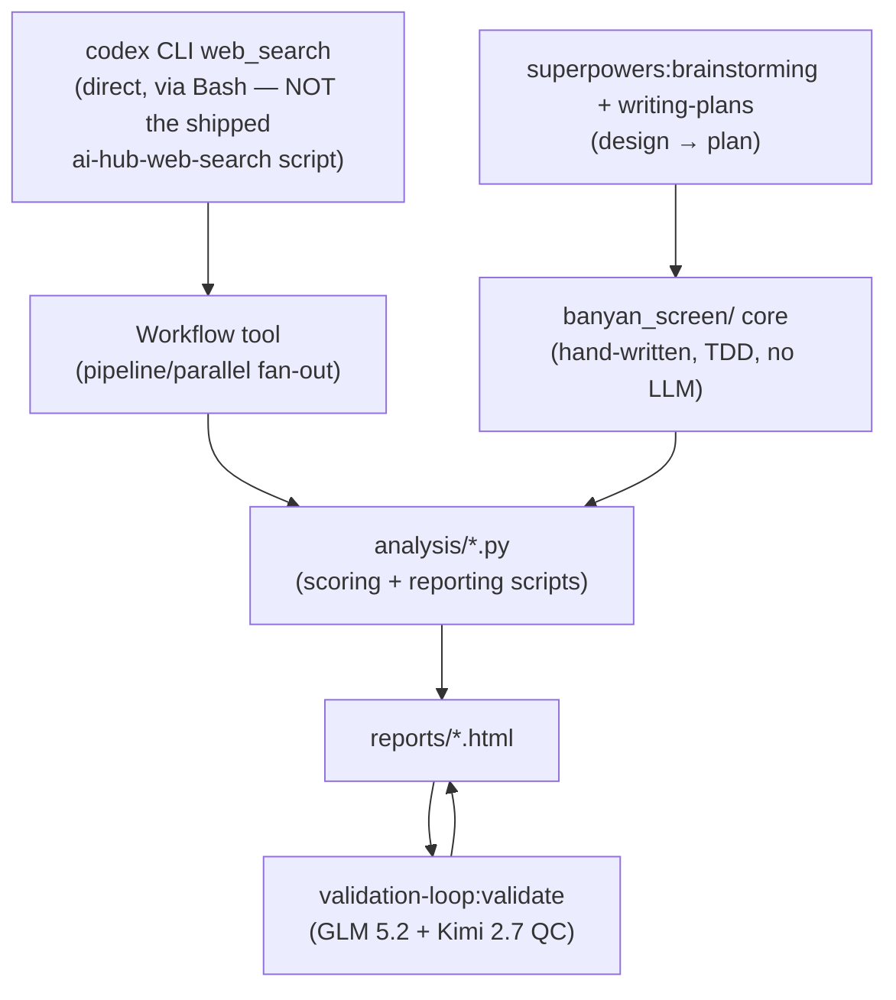

# Tooling & Capability Log

What actually ran this project, end to end: skills, MCP servers, plugins, and hooks. Scoped to **this project's own work** (banyan-ma-research) — the wider Claude Code environment has many more tools configured; the "Configured but unused" sections below list what was available but never called here, so absence isn't ambiguous.

---

## 1. Skills invoked

| Skill | Source | Purpose in this project | Outcome |
|---|---|---|---|
| `init` | Built-in | Bootstrap `CLAUDE.md` at session start (workspace-wide, not project-specific) | Done, unrelated commits mirrored to `.cursorrules`/`AGENTS.md`/etc. |
| `superpowers:brainstorming` | Plugin: `superpowers` | Scoped the M&A pipeline architecture and the IAM role hierarchy before building either | Design approved, proceeded to `writing-plans` |
| `superpowers:writing-plans` | Plugin: `superpowers` | Produced the Build-1 scoring-core implementation plan (`docs/superpowers/plans/2026-09-11-banyan-scoring-core.md`) | Plan executed task-by-task |
| `perplexity-research` | User skill (`~/.claude/skills/perplexity-research`) | Attempted as a discovery engine per user request | **Failed** — no `PERPLEXITY_API_KEY` configured (auth-walled); abandoned in favor of codex |
| `firecrawl:firecrawl-scrape` | Plugin: `firecrawl` | Attempted as a discovery/scrape engine | **Failed** — firecrawl CLI installed but not authenticated (`firecrawl login` never run); abandoned |
| `ai-hub-web-search:codex-websearch` | Plugin: `ai-hub-web-search` | The skill whose *documented pattern* (dispatch web search from a subagent, sanitize the query, cite sources) underpins every research call | Pattern adopted; **the shipped `websearch.sh` script itself was bypassed** — it hardcoded invalid model IDs and `/tmp` (sandbox-blocked) — in favor of calling the `codex` CLI directly with corrected flags (see §2) |
| `workflow-authoring` | Bundled skill | Reference for authoring every multi-agent `Workflow` script (`pipeline`/`parallel`/`agent` primitives, schema-forced output, resume semantics) | Loaded before each of the ~10 Workflow invocations in this project |
| `handoff` | User skill (`~/.claude/skills/handoff`) | Produced `docs/HANDOFF.md` | Done |
| `validation-loop:validate` | Plugin: `validation-loop` | Independent second-model QC of session changes | Run **twice** — round 1: REVIEW 65.9/100; round 2 (after fixes): REVIEW 66.9/100. Advisory mode, not blocking. |

**Not a Skill, but load-bearing:** the **`codex` CLI** itself (OpenAI Codex, ChatGPT-authenticated, `gpt-5.6-sol`, `--search`) — invoked directly via `Bash` inside every research-stage agent, **foreground, sandbox disabled**. This is the actual discovery engine behind Discovery Passes 1–3, the market-synthesis research, and every dossier's grounding text. It is an external CLI tool, not a Claude Code skill/plugin/MCP.

## 2. Built-in Claude Code tools relied on

| Tool | Role |
|---|---|
| `Workflow` | Multi-agent orchestration — ~10 runs across this project (vertical discovery batches, top-25 dossier+pitch generation ×2 lists, 14-segment market synthesis, acquirer-adjacency discovery, OSINT discovery+verification). Concurrency-capped fan-out with cached resume. |
| `Agent` | Subagent dispatch (`general-purpose` type) for the codex-websearch execution pattern and background research forks. |
| `Bash` | All codex CLI invocations, `pytest` runs, file/dir operations, the reorg's move/delete commands — always with `dangerouslyDisableSandbox: true` where codex or GUI `open` required network/GUI access the sandbox blocks by default. |
| `Read` / `Write` / `Edit` | All source, config, and documentation files in the repo. |
| `AskUserQuestion` | Scoping decisions at each major fork: data-source constraints, discovery scale, research depth (top-25-deep vs 250-synthesis), pitch-skill scope, rubric choice for the final dossier list. |

**Not used in this project:** `Artifact` (deliverables are local self-contained HTML files opened via `open`, never published as claude.ai artifacts), `ScheduleWakeup`, `CronCreate`, `EnterPlanMode`.

## 3. MCP servers

**None.** Verified by grep across every script and workflow file (`analysis/`, `banyan_screen/`) — zero `mcp__*` tool calls exist in this project. All external data access went through the `codex` CLI (via `Bash`) instead.

**Configured in the wider environment but not used here:** `datadog`, `deep-insights`, `github-enterprise`, `atlassian`, `playwright`, `slack`, `second-brain`, `smart-mesh`, the `paypal-mcp-hub-zone1/2` gateway, and the GCP `dak` server family (BigQuery, AlloyDB, Cloud SQL, Bigtable, Spanner, Dataproc, Cloud Storage, Notebook). None of these apply to public-web M&A research and none were invoked.

## 4. Plugins (that backed the skills above)

| Plugin | Version | Skills/commands used |
|---|---|---|
| `superpowers` | (marketplace: claude-plugins-official) | `brainstorming`, `writing-plans`, `using-superpowers` (always-active meta-skill) |
| `ai-hub-web-search` | 1.3.2 | `codex-websearch` (pattern only — script bypassed, see §1) |
| `firecrawl` | 1.0.9 | `firecrawl-scrape` (attempted, failed — unauthenticated) |
| `validation-loop` | 1.3.0 | `/validate` command, `glm-qc` subagent (GLM 5.2 + Kimi 2.7 tie-breaker) |

## 5. Hooks

| Hook | Trigger | Role in this project |
|---|---|---|
| **Stop-hook Goal** | Fires on session Stop while the tracked goal condition is unmet | Set at session start: *"Get context on Banyan, then build the agentic M&A solution."* Fired at least once mid-session as automated feedback requesting visible build progress — surfaced as a `<system-reminder>`, not a user message; treated as a nudge, not an instruction to fabricate progress. |
| **PostToolUse marker hook** (`validation-loop`) | Runs after file-modifying tool calls | Silently tracks which files changed during the session; consumed by `/validate` to scope the QC review to actual session changes. No visible output of its own. |
| **`ai-qc-guardrails` automatic Stop-hook review** (GLM 5.2 auto-QC, tie-broken by Kimi) | Configured workspace-wide per the global `CLAUDE.md`, fires after tasks *regardless of project directory* | **Available but not the mechanism used for this project's QC** — this session used the **manual** `/validate` command (see §1) instead of relying on the automatic per-task Stop-hook variant. Toggle state tracked in auto-memory `project-glm-qc-autoreview.md`, not in this repo. |

No FSEvents watchers, PreToolUse hooks, or custom project-local hooks (`.claude/hooks/`) apply to this project.

## 6. Summary — what actually produced the deliverables

Two attempted tools (`perplexity-research`, `firecrawl-scrape`) never contributed data — both failed on missing authentication and were abandoned in favor of the working codex path. That failure-and-pivot is itself part of the record, not omitted.
